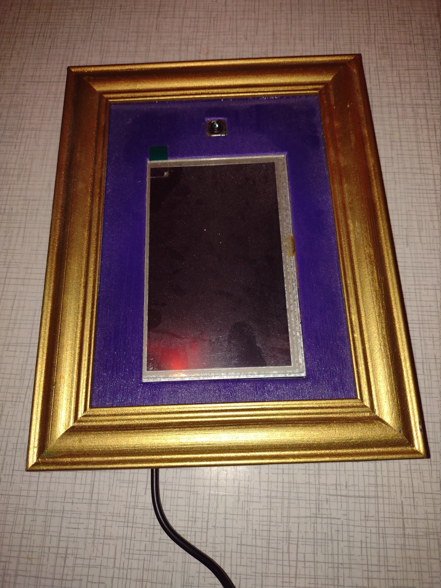
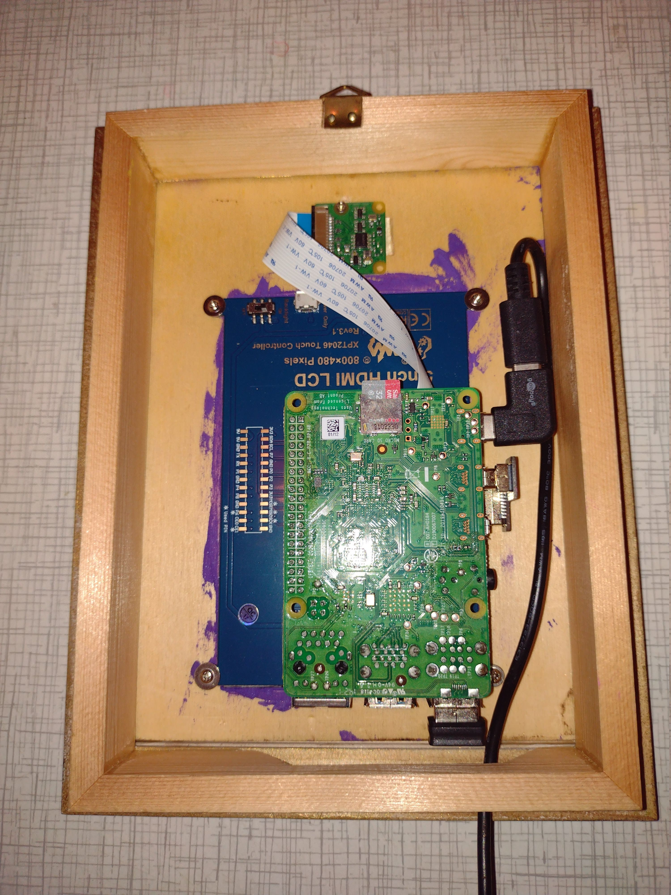

# GodjePrint 
This is a Photobooth application designed to directly print on Epson Thermal Printers.

<div style="display:flex; margin-bottom:5px">


</div>


### Setup
  1. Setup a SD-Card with Raspian OS
  2. Copy contents of this repository to the device
  3. Run the `install.sh` script inside this repository on the Raspberry Pi using sudo!
  4. Run the `install_printer.sh` script inside this repository on the Raspberry Pi using sudo!


### Debugging
To follow application log use
```
sudo journalctl -fu gprint.service
```
